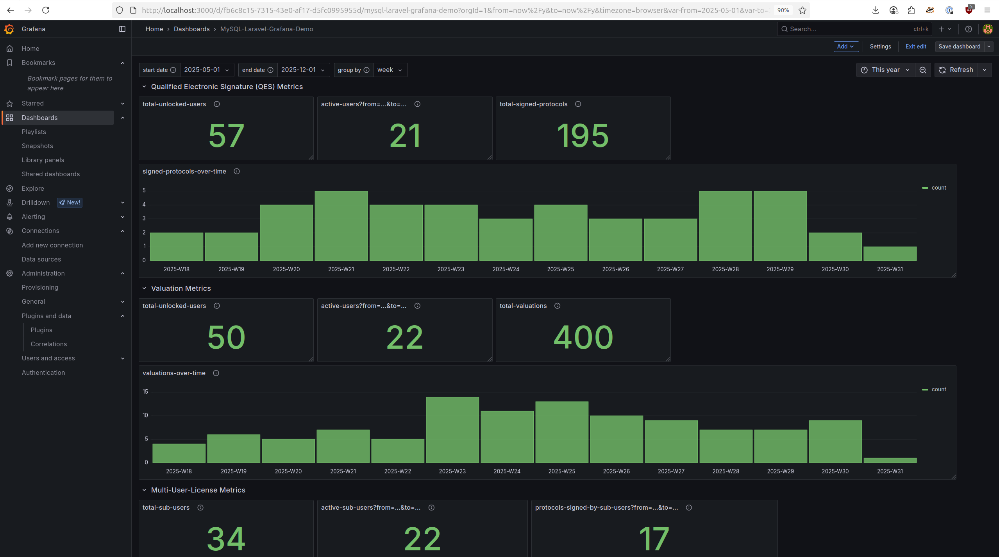
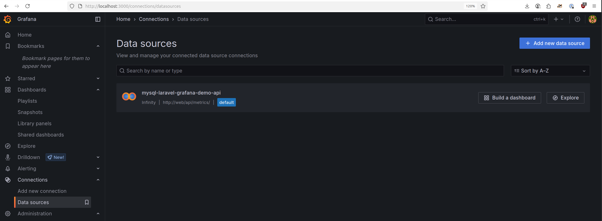

# Grafana Documentation <!-- omit in toc -->

Visit the Grafana instance at http://localhost:3000 (the default credentials are user `admin` and password `admin`)..

> If you keep this demo local to your PC, when prompted to update your password on first login, you can just keep `admin`.

## Table of Contents <!-- omit in toc -->

- [The Dashboard](#the-dashboard)
- [The Data Source](#the-data-source)
- [Configuration as Code](#configuration-as-code)
  - [Export the Configuration](#export-the-configuration)

## The Dashboard

> Navigation: Dashboards > "MySQL-Laravel-Grafana-Demo"

The dashboard is composed of three types of visualization panels

- Stat
- Stat (but configurable via the variables `start date`, `end date` and `group by` at the top)
- Bar Chart

## The Data Source

The source of the data here is our Laravel JSON API.

Grafana offers a variety of Plugins to easily consume data -
in this case (a REST API endpoint serving JSON data) the best fit is the [Infinity data source plugin](https://grafana.com/docs/plugins/yesoreyeram-infinity-datasource/latest/),
which is already installed in the Grafana instance here, by having passed the environment variable
`GF_INSTALL_PLUGINS=yesoreyeram-infinity-datasource` on the Grafana Docker container.

> Navigation: Connections > Data sources > "mysql-laravel-grafana-demo-api"

I just configured the Base URL `http://web/api/metrics/` and the custom HTTP header `Accept: application/json`.

## Configuration as Code

Grafana calls its setup of an instance via configuration files **"Provisioning"**.

There is documentation...

- Administration > [Provision Grafana](https://grafana.com/docs/grafana/latest/administration/provisioning/)
- Plugins > Infinity data source > Setup > [Provisioning](https://grafana.com/docs/plugins/yesoreyeram-infinity-datasource/latest/setup/provisioning/) 

... and a proper guide:

- [Provision dashboards and data sources](https://grafana.com/tutorials/provision-dashboards-and-data-sources/) (this is a lot more helpful than the documentation above)

### Export the Configuration

Configure dashboards and data sources via the UI and export them as JSON/YAML.

> Log into the Grafana instance at http://localhost:3000.

- For the dashboard: go to Dashboards > Export > Export as JSON > Download file
- For the data source: go to Data sources > `mysql-laravel-grafana-demo-api` > Main > Provisioning Script
